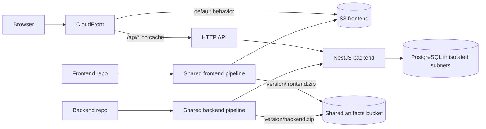

# RealWorld fullstack infrastructure

Terraform that provisions **shared CI/CD** plus a **stage** and **production** environment for an Angular 21 frontend and a NestJS backend.

The frontend is a static site in S3, served (together with the API) by a dual-origin CloudFront distribution. Terraform creates the HTTP API; the NestJS application attaches its own routes.

Pipelines and the release-artifacts bucket live in `shared/` and serve **both** environments:

Source → Validate → Build → Test → **Deploy-Stage** → **Approval** → **Deploy-Production**

Each CodeBuild project loads its buildspec **from the application repository**. Deploy stages set `ENVIRONMENT=stage` or `ENVIRONMENT=production` and read targets from SSM (`/${project_name}/${ENVIRONMENT}/...`).

## Architecture



Traffic to the site never talks to S3 directly:

- S3 is private. CloudFront reads it with Origin Access Control (OAC).
- `/api/*` uses the AWS managed **CachingDisabled** cache policy so NestJS responses are not cached.
- WAF is **not provisioned** (show it on architecture slides). Workloads in private subnets reach AWS and the internet through a **NAT gateway in each AZ**.
- A free **S3 gateway endpoint** keeps S3 traffic off the NAT. Paid interface VPC endpoints are omitted because nine of them across two AZs cost more than the NAT (~$130/month vs ~$32/month).

## Apply order

There are **three state files**. Apply them in this order:

1. **shared** — artifacts bucket, CodeStar connection, frontend and backend pipelines
2. **stage** — VPC, RDS, frontend bucket, HTTP API, CloudFront
3. **production** — same layout as stage

```bash
cp shared/terraform.tfvars.example shared/terraform.tfvars
# edit repository ids and approval emails

cd shared
terraform init
terraform apply
cd ..

cp environments/stage.tfvars.example terraform.tfvars
terraform init
terraform apply -var-file=environments/stage.tfvars.example

terraform apply -var-file=environments/production.tfvars.example
```

Use a **separate backend key** for production (for example `production/terraform.tfstate`). Stage currently uses `stage/terraform.tfstate`; shared uses `shared/terraform.tfstate`.

Environment stacks read `/<project>/shared/...` SSM parameters created by the shared stack. Applying stage or production before shared will fail.

## Environments

| Setting | stage | production |
| --- | --- | --- |
| RDS | Single-AZ, `db.t4g.micro` | Multi-AZ, `db.t4g.small` |
| Backup retention | 7 days | 30 days |
| Deletion protection | off | on |
| CloudFront price class | 100 | All |
| Pipeline | shared | shared (manual approval before production deploy) |

## What Terraform creates

### `shared/`

- One artifacts bucket used by both environments
- Frontend and backend CodePipelines (four CodeBuild projects each)
- Account-scoped CodePipeline and CodeBuild IAM roles (`modules/iam_cicd`)
- GitHub CodeStar connection (if you do not pass an existing ARN)
- Approval SNS topic
- KMS CMK for pipeline artifacts

### Each environment

- VPC across **two AZs** with public, application, and isolated database subnets
- Internet gateway, one NAT gateway per AZ, and a free S3 gateway endpoint
- Application and RDS security groups (PostgreSQL only from the application)
- Encrypted PostgreSQL with Secrets Manager-managed master password and SSL enforced
- Frontend origin bucket
- HTTP API Gateway
- CloudFront with S3 + API origins and SPA routing function. No WAF.
- KMS CMK, SSM parameters, alarms, a dashboard, and a monthly budget

Release artifacts are stored as:

```text
s3://<artifacts-bucket>/<version>/frontend.zip
s3://<artifacts-bucket>/<version>/backend.zip
```

`<version>` comes from the application `package.json` plus the short git SHA (see the example buildspecs). One build artifact is promoted: stage first, then production.

## Pipeline contract

Copy the files under `examples/buildspecs/frontend/` and `examples/buildspecs/backend/` into each application repository (paths default to `scripts/buildspec-*.yml`).

Terraform does not inline those files. Each CodeBuild project sets `buildspec` to the repository path (overridable with `frontend_buildspec_*` / `backend_buildspec_*` in `shared/`).

### First pipeline run

1. Apply **shared**, then **stage**, then **production**.
2. If `codestar_connection_arn` was empty, open **Developer Tools → Connections** and authorize GitHub.
3. Confirm the approval email subscription from the shared stack.
4. Confirm the AWS Connector for GitHub app can access the application repositories.
5. The frontend pipeline syncs `frontend.zip` to the stage origin, waits for approval, then deploys production.

## Well-Architected notes

- **Security:** KMS encryption, TLS-only bucket policies, S3 Block Public Access, OAC, no public RDS, CloudFront TLS 1.2+ and HTTPS-only API origin.
- **Reliability:** two AZs, Multi-AZ RDS in production, isolated database subnets, queued pipeline executions.
- **Performance:** CloudFront HTTP/2+3, caching for static assets, uncached API path.
- **Cost:** NAT per AZ instead of interface VPC endpoints, no WAF or access-log bucket, log expiration, budgets and SNS alerts.
- **Operational excellence:** API access logs, CodePipeline notifications, CloudWatch dashboard, SSM parameters as the contract with the shared pipelines.

The demo URL is the CloudFront default hostname (`https://dxxxxx.cloudfront.net`), available as the `application_url` output of each environment stack.
